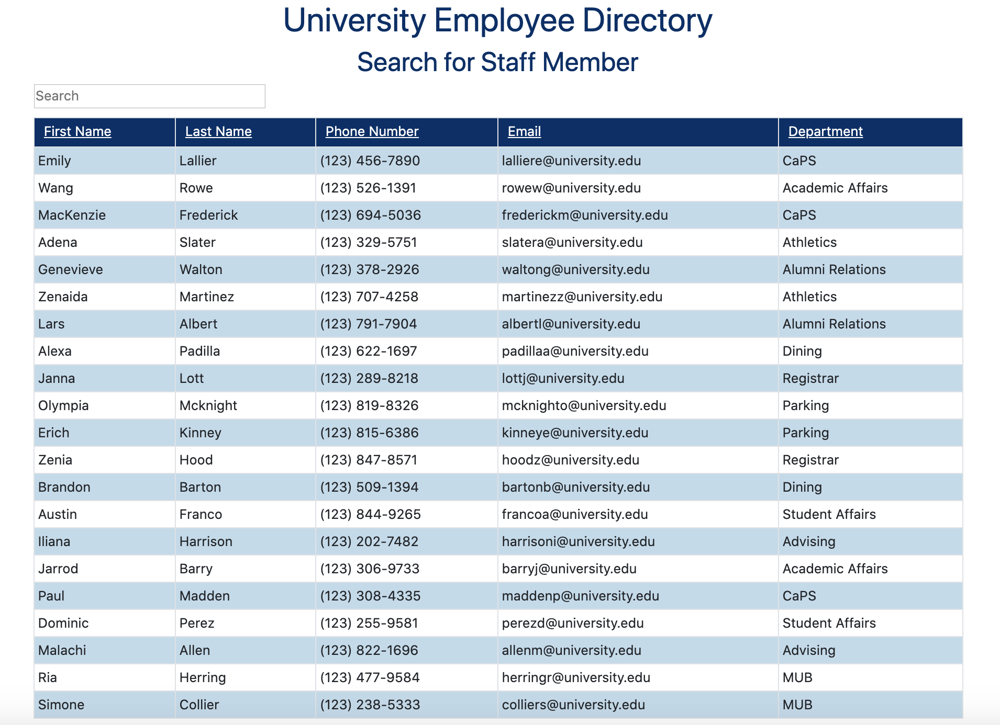

# Employee Directory

## Project Description:

### <i>Ever need to quickly look up non-sensitive information about your employees or colleagues?</i>

This application will allow the user to view a table of all employees, and either sort the table or search for an employee by any of the following criteria:
* First Name
* Last Name
* Phone Number
* Email Address
* Department

## Preview:

## Built With:

* This project was bootstrapped with [Create React App](https://github.com/facebook/create-react-app)
* React
* Javascript
* Node.js
* React Bootstrap

## Links:
* Deployed App: [https://lalliere.github.io/employee-directory-react/](https://lalliere.github.io/employee-directory-react/)
* GitHub Repo: [https://github.com/lalliere/employee-directory-react](https://github.com/lalliere/employee-directory-react)

## Got Questions?
### Ask Me:
* GitHub Profile: https://github.com/lalliere
* My Email: emilylallier@yahoo.com 
